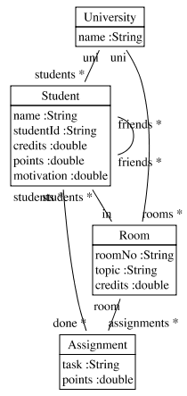
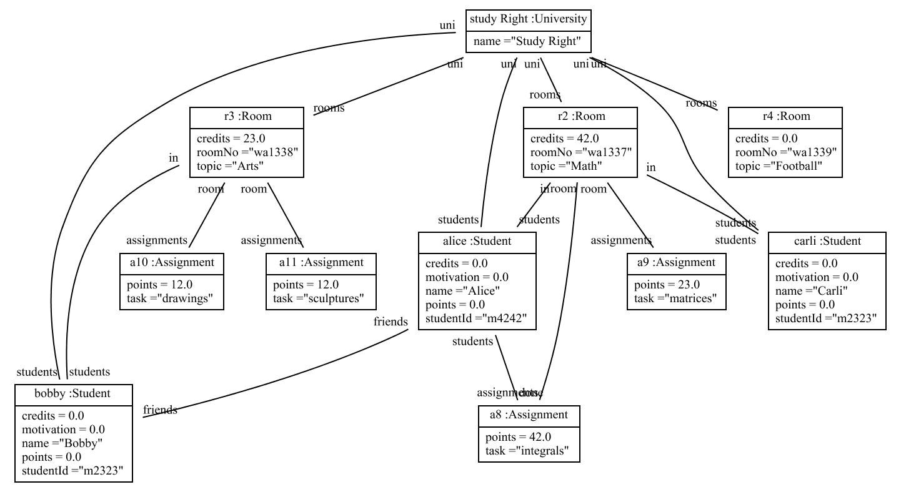
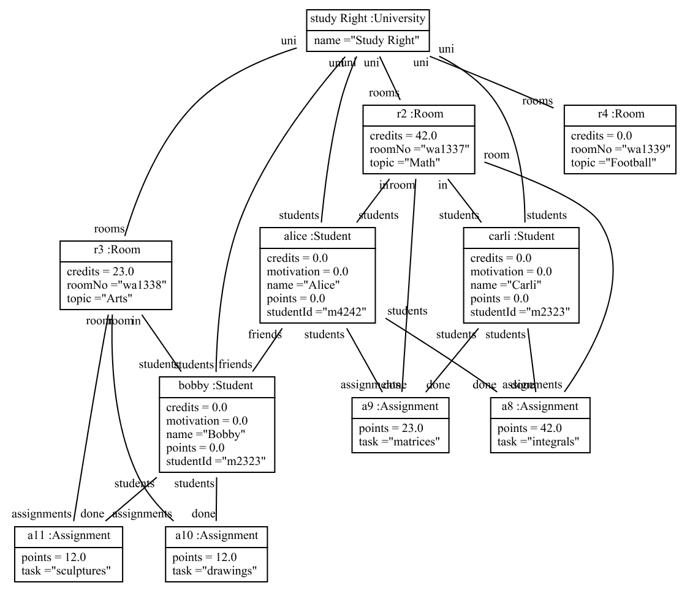
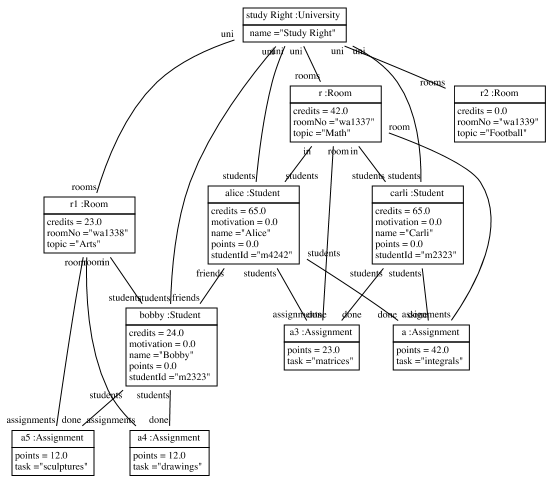

# fulibTables

Fulib Tables are the model query and transformation mechanisms provided by Fulib.

## Installation

`build.gradle`:

```groovy
repositories {
    mavenCentral()
    jcenter()
}
```

```groovy
dependencies {
    // https://mvnrepository.com/artifact/org.fulib/fulibTables
    compile group: 'org.fulib', name: 'fulibTables', version: '1.3.0'
}
```

## Usage

To demonstrate Fulib Tables we start with an extended version
of the StudyRight University class model:

<!-- insert_code_fragment: FulibTables.classmodel | fenced:java -->
```java
ClassModelBuilder mb = Fulib.classModelBuilder("uniks.studyright.model", "src/test/java");

ClassBuilder university = mb.buildClass("University").buildAttribute("name", STRING);

ClassBuilder student = mb.buildClass("Student")
                         .buildAttribute("name", STRING)
                         .buildAttribute("studentId", STRING)
                         .buildAttribute("credits", DOUBLE)
                         .buildAttribute("points", DOUBLE)
                         .buildAttribute("motivation", DOUBLE);

ClassBuilder room = mb.buildClass("Room")
                      .buildAttribute("roomNo", STRING)
                      .buildAttribute("topic", STRING)
                      .buildAttribute("credits", DOUBLE);

ClassBuilder assignment = mb.buildClass("Assignment")
                            .buildAttribute("task", STRING)
                            .buildAttribute("points", DOUBLE);

university.buildAssociation(student, "students", MANY, "uni", ONE);
university.buildAssociation(room, "rooms", MANY, "uni", ONE);
room.buildAssociation(student, "students", MANY, "in", ONE);
room.buildAssociation(assignment, "assignments", MANY, "room", ONE);
student.buildAssociation(assignment, "done", MANY, "students", MANY);
student.buildAssociation(student, "friends", MANY, "friends", MANY);

ClassModel model = mb.getClassModel();

FulibTools.classDiagrams().dumpSVG(model, "doc/images/MainClassDiagram.svg");
FulibTools.classDiagrams().dumpPng(model, "doc/images/MainClassDiagram.png");

Fulib.generator().generate(model);
```
<!-- end_code_fragment: -->


Rendered as a class diagram the extended class model looks like:



Once the generated code is compiled we may construct some objects:

<!-- insert_code_fragment: FulibTables.objectModel | fenced:java -->
```java
// build object structure
University studyRight = new University().setName("Study Right");

Room mathRoom = new Room().setRoomNo("wa1337").setTopic("Math").setCredits(42.0).setUni(studyRight);
Room artsRoom = new Room().setRoomNo("wa1338").setTopic("Arts").setCredits(23.0).setUni(studyRight);
Room sportsRoom = new Room().setRoomNo("wa1339").setTopic("Football").setUni(studyRight);

Assignment integrals = new Assignment().setTask("integrals").setPoints(42).setRoom(mathRoom);
Assignment matrix = new Assignment().setTask("matrices").setPoints(23).setRoom(mathRoom);
Assignment drawings = new Assignment().setTask("drawings").setPoints(12).setRoom(artsRoom);
Assignment sculptures = new Assignment().setTask("sculptures").setPoints(12).setRoom(artsRoom);

Student alice = new Student().setStudentId("m4242").setName("Alice").setUni(studyRight).setIn(mathRoom).withDone(integrals);
Student bob   = new Student().setStudentId("m2323").setName("Bobby").setUni(studyRight).setIn(artsRoom).withFriends(alice);
Student carli = new Student().setStudentId("m2323").setName("Carli").setUni(studyRight).setIn(mathRoom);

FulibTools.objectDiagrams().dumpSVG("doc/images/studyRightObjects.svg", studyRight);
FulibTools.objectDiagrams().dumpPng("doc/images/studyRightObjects.png", studyRight);
```
<!-- end_code_fragment: -->

This results in:




Fulib Tables provides class ObjectTable which allows us to do some table stuff:


<!-- insert_code_fragment: FulibTables.createUniTable1 | fenced:java -->
```java
// some table stuff
ObjectTable<University> universityTable = new ObjectTable<>("University", studyRight);
ObjectTable<Room> roomsTable = universityTable.expandAll("Room", University::getRooms);
ObjectTable<Assignment> assignmentsTable = roomsTable.expandAll("Assignment", Room::getAssignments);
```
<!-- end_code_fragment: -->

The first line generates an "universityTable" with just one "University" column
and with just one row containing the "StudyRight" object.

<!-- insert_code_fragment: FulibTables.uniTable1 -->
| University 	|
| --- |
| Study Right 	|
<!-- end_code_fragment: -->

The second line extends the universityTable with a "Room" column.
For each (the single) row of the old table we look up the University u contained
in the University column
(in our case there is just one row containing the studyRight object in its University column).
For each such uni object u, we look up each room r
attached to it. For each uni object u and room r pair, we create a new row
in the resulting "roomsTable" table.

<!-- insert_code_fragment: FulibTables.uniTable2 -->
| University 	| Room 	|
| --- | --- |
| Study Right 	| wa1337 Math 	|
| Study Right 	| wa1338 Arts 	|
| Study Right 	| wa1339 Football 	|
<!-- end_code_fragment: -->


The third line expands the roomsTable with the attached assignments.
Again we loop through the rows of the roomsTable and look up the University
u contained in the University column and the room
r contained in the Room column. Then, for each assignment a attached to room r
we create a result row containg u, r, and a.

The table below shows the current result:

<!-- insert_code_fragment: FulibTables.uniTable3 -->
| University 	| Room 	| Assignment 	|
| --- | --- | --- |
| Study Right 	| wa1337 Math 	| integrals 	|
| Study Right 	| wa1337 Math 	| matrices 	|
| Study Right 	| wa1338 Arts 	| drawings 	|
| Study Right 	| wa1338 Arts 	| sculptures 	|
<!-- end_code_fragment: -->

Note, all three variables universityTable, roomsTable, and assignmentsTable
refer to the same internal table object. However, they each use a wrapper
that encapsulates the internal table and refers to the specific column where the next
expand operation applies.

Each table wrapper also offers is also an `Iterable` listing all objects
of the corresponding column. Thus, to sum up the points of all assignments
of our table we may:

<!-- insert_code_fragment: FulibTables.loop_through_assignments | fenced:java -->
```java
double sum = 0;
for (Assignment a : assignmentsTable)
{
   sum += a.getPoints();
}
assertThat(sum, equalTo(89.0));
```
<!-- end_code_fragment: -->

Alternatively, we may expand the assignmentsTable by a "Points" column:

<!-- insert_code_fragment: FulibTables.pointsTable | fenced:java -->
```java
doubleTable pointsTable = assignmentsTable.expand("Points", Assignment::getPoints).as(doubleTable.class);
sum = pointsTable.sum();
assertThat(roomsTable.rowCount(), equalTo(4));
assertThat(assignmentsTable.rowCount(), equalTo(4));
assertThat(sum, equalTo(89.0));
```
<!-- end_code_fragment: -->

<!-- insert_code_fragment: FulibTables.pointsTableResult -->
| University 	| Room 	| Assignment 	| Points 	|
| --- | --- | --- | --- |
| Study Right 	| wa1337 Math 	| integrals 	| 42.0 	|
| Study Right 	| wa1337 Math 	| matrices 	| 23.0 	|
| Study Right 	| wa1338 Arts 	| drawings 	| 12.0 	|
| Study Right 	| wa1338 Arts 	| sculptures 	| 12.0 	|
<!-- end_code_fragment: -->

The resulting pointsTable has a sum method that sums up all
double values contained in the corresponding column.

To further expand our table we might add students that are in rooms:

<!-- insert_code_fragment: FulibTables.studentsTable | fenced:java -->
```java
ObjectTable<Student> students = roomsTable.expandAll("Student", Room::getStudents);
assertThat(students.rowCount(), equalTo(6));
```
<!-- end_code_fragment: -->

<!-- insert_code_fragment: FulibTables.studentsTableResult -->
| University 	| Room 	| Assignment 	| Points 	| Student 	|
| --- | --- | --- | --- | --- |
| Study Right 	| wa1337 Math 	| integrals 	| 42.0 	| Alice m4242 	|
| Study Right 	| wa1337 Math 	| integrals 	| 42.0 	| Carli m2323 	|
| Study Right 	| wa1337 Math 	| matrices 	| 23.0 	| Alice m4242 	|
| Study Right 	| wa1337 Math 	| matrices 	| 23.0 	| Carli m2323 	|
| Study Right 	| wa1338 Arts 	| drawings 	| 12.0 	| Bobby m2323 	|
| Study Right 	| wa1338 Arts 	| sculptures 	| 12.0 	| Bobby m2323 	|
<!-- end_code_fragment: -->

The resulting table has the cross product of assignments and students
for each room.

In addition to the cross product we may select a subset of the
table rows using a filter operation:

<!-- insert_code_fragment: FulibTables.filterAssignmentsTable | fenced:java -->
```java
assignmentsTable.filter(a -> a.getPoints() <= 30);
assertThat(students.rowCount(), equalTo(4));
```
<!-- end_code_fragment: -->

<!-- insert_code_fragment: FulibTables.filterAssignmentsTableResult -->
| University 	| Room 	| Assignment 	| Points 	| Student 	|
| --- | --- | --- | --- | --- |
| Study Right 	| wa1337 Math 	| matrices 	| 23.0 	| Alice m4242 	|
| Study Right 	| wa1337 Math 	| matrices 	| 23.0 	| Carli m2323 	|
| Study Right 	| wa1338 Arts 	| drawings 	| 12.0 	| Bobby m2323 	|
| Study Right 	| wa1338 Arts 	| sculptures 	| 12.0 	| Bobby m2323 	|
<!-- end_code_fragment: -->

Alternatively we may filter by rows:

<!-- insert_code_fragment: FulibTables.filterRowTable | fenced:java -->
```java
// filter row
universityTable = new ObjectTable<>("University", studyRight);
roomsTable = universityTable.expandAll("Room", University::getRooms);
students = roomsTable.expandAll("Student", Room::getStudents);
assignmentsTable = roomsTable.expandAll("Assignment", Room::getAssignments);

students.filterRows(row -> {
   Student studi = (Student) row.get("Student");
   Assignment assignment = (Assignment) row.get("Assignment");
   return studi.getDone().contains(assignment);
});

assertThat(students.rowCount(), equalTo(1));
```
<!-- end_code_fragment: -->

<!-- insert_code_fragment: FulibTables.filterRowTableResult -->
| University 	| Room 	| Student 	| Assignment 	|
| --- | --- | --- | --- |
| Study Right 	| wa1337 Math 	| Alice m4242 	| integrals 	|

<!-- end_code_fragment: -->

Note, when we did the filter by assignment, our internal table had
been reduced to 4 rows. To have a full table for the filter by row
operation, we had to reconstruct that full table.

Above row filter requires that the current student has done the
current assignment. This filter condition may also be expressed by a
hasLink operation:

<!-- insert_code_fragment: FulibTables.filterHasDone | fenced:java -->
```java
// filter row
universityTable = new ObjectTable<>("University", studyRight);
roomsTable = universityTable.expandAll("Room", University::getRooms);
students = roomsTable.expandAll("Student", Room::getStudents);
assignmentsTable = roomsTable.expandAll("Assignment", Room::getAssignments);
students.hasLink(Student.PROPERTY_done, assignmentsTable);

assertThat(students.rowCount(), equalTo(1));
```
<!-- end_code_fragment: -->

<!-- insert_code_fragment: FulibTables.filterHasDoneResult -->
| University 	| Room 	| Student 	| Assignment 	|
| --- | --- | --- | --- |
| Study Right 	| wa1337 Math 	| Alice m4242 	| integrals 	|
<!-- end_code_fragment: -->


Maybe its bad style, but the filter operations may also be used to modify
the current model:

<!-- insert_code_fragment: FulibTables.doCurrentAssignments | fenced:java -->
```java
universityTable = new ObjectTable<>("University", studyRight);
roomsTable = universityTable.expandAll("Room", University::getRooms);
students = roomsTable.expandAll("Student", Room::getStudents);
assignmentsTable = roomsTable.expandAll("Assignment", Room::getAssignments);

// do current assignments
students.filterRows(row -> {
   Student studi = (Student) row.get("Student");
   Assignment assignment = (Assignment) row.get("Assignment");
   studi.withDone(assignment);
   return true;
});

FulibTools.objectDiagrams().dumpPng("doc/images/studyRightObjectsMoreDone4Tables.png", studyRight);

assertThat(alice.getDone().size(), equalTo(2));
assertThat(integrals.getStudents().contains(alice), is(true));

// show size of done
universityTable.derive("noOfDone", row -> {
   Student studi = (Student) row.get("Student");
   return studi.getDone().size();
});

// show done
students.expandAll("Done", Student::getDone);
```
<!-- end_code_fragment: -->

<!-- insert_code_fragment: FulibTables.doCurrentAssignmentsResult -->
| University 	| Room 	| Student 	| Assignment 	| noOfDone 	| Done 	|
| --- | --- | --- | --- | --- | --- |
| Study Right 	| wa1337 Math 	| Alice m4242 	| integrals 	| 2 	| integrals 	|
| Study Right 	| wa1337 Math 	| Alice m4242 	| integrals 	| 2 	| matrices 	|
| Study Right 	| wa1337 Math 	| Alice m4242 	| matrices 	| 2 	| integrals 	|
| Study Right 	| wa1337 Math 	| Alice m4242 	| matrices 	| 2 	| matrices 	|
| Study Right 	| wa1337 Math 	| Carli m2323 	| integrals 	| 2 	| integrals 	|
| Study Right 	| wa1337 Math 	| Carli m2323 	| integrals 	| 2 	| matrices 	|
| Study Right 	| wa1337 Math 	| Carli m2323 	| matrices 	| 2 	| integrals 	|
| Study Right 	| wa1337 Math 	| Carli m2323 	| matrices 	| 2 	| matrices 	|
| Study Right 	| wa1338 Arts 	| Bobby m2323 	| drawings 	| 2 	| drawings 	|
| Study Right 	| wa1338 Arts 	| Bobby m2323 	| drawings 	| 2 	| sculptures 	|
| Study Right 	| wa1338 Arts 	| Bobby m2323 	| sculptures 	| 2 	| drawings 	|
| Study Right 	| wa1338 Arts 	| Bobby m2323 	| sculptures 	| 2 	| sculptures 	|
<!-- end_code_fragment: -->



As the current table contains some confusing cross products let
us drop the Assignment column:

<!-- insert_code_fragment: FulibTables.dropColumnsAssignment | fenced:java -->
```java
universityTable.dropColumns("Assignment");
```
<!-- end_code_fragment: -->

<!-- insert_code_fragment: FulibTables.dropColumnsAssignmentResult -->
| University 	| Room 	| Student 	| noOfDone 	| Done 	|
| --- | --- | --- | --- | --- |
| Study Right 	| wa1337 Math 	| Alice m4242 	| 2 	| integrals 	|
| Study Right 	| wa1337 Math 	| Alice m4242 	| 2 	| matrices 	|
| Study Right 	| wa1337 Math 	| Carli m2323 	| 2 	| integrals 	|
| Study Right 	| wa1337 Math 	| Carli m2323 	| 2 	| matrices 	|
| Study Right 	| wa1338 Arts 	| Bobby m2323 	| 2 	| drawings 	|
| Study Right 	| wa1338 Arts 	| Bobby m2323 	| 2 	| sculptures 	|
<!-- end_code_fragment: -->

Alternatively, we may select the columns we are interested in:

<!-- insert_code_fragment: FulibTables.selectColumns | fenced:java -->
```java
students.selectColumns("Student", "Done");
assertThat(students.rowCount(), equalTo(6));
```
<!-- end_code_fragment: -->

<!-- insert_code_fragment: FulibTables.selectColumnsResult -->
| Student 	| Done 	|
| --- | --- |
| Alice m4242 	| integrals 	|
| Alice m4242 	| matrices 	|
| Carli m2323 	| integrals 	|
| Carli m2323 	| matrices 	|
| Bobby m2323 	| drawings 	|
| Bobby m2323 	| sculptures 	|
<!-- end_code_fragment: -->

Note, you may use nested tables. This is handy if you
want to update all elements of a certain column.

<!-- insert_code_fragment: FulibTables.nestedTables | fenced:java -->
```java
universityTable = new ObjectTable<>("University", studyRight);
students = universityTable.expandAll("Students", University::getStudents);
students.derive("Credits", row -> {
   Student student = (Student) row.get("Students");
   double pointSum = new ObjectTable<>(student)
      .expandAll("Assignments", Student::getDone)
      .expand("Points", Assignment::getPoints)
      .as(doubleTable.class)
      .sum();
   student.setCredits(pointSum);
   return pointSum;
});
students.derive("Done", row -> {
   Student student = (Student) row.get("Students");
   return new ObjectTable<>("Students", student)
      .expandAll("Assignments", Student::getDone)
      .expand("Tasks", Assignment::getTask)
      .as(StringTable.class)
      .join(", ");
});
```
<!-- end_code_fragment: -->

Note, in the third last line operation expandTopic adds a column with
the topic names of the corresponding assignments to the local table.
On string columns one may call join in order to concatenate all
strings.

<!-- insert_code_fragment: FulibTables.nestedTablesResult -->
| University 	| Students 	| Credits 	| Done 	|
| --- | --- | --- | --- |
| Study Right 	| Alice m4242 	| 65.0 	| integrals, matrices 	|
| Study Right 	| Bobby m2323 	| 24.0 	| drawings, sculptures 	|
| Study Right 	| Carli m2323 	| 65.0 	| integrals, matrices 	|
<!-- end_code_fragment: -->




