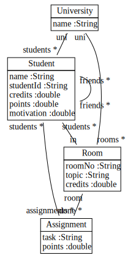

# fulibTables

Welcome to the fulibTables documentation.
In the following pages, we will explain how to create and work with fulib tables.
All pages share a common class model which we define using fulib:

<!-- insert_code_fragment: FulibTables.classmodel | fenced:java -->
```java
ClassModelBuilder mb = Fulib.classModelBuilder("uniks.studyright.model", "src/test/java");

ClassBuilder university = mb.buildClass("University").buildAttribute("name", STRING);

ClassBuilder student = mb.buildClass("Student")
                         .buildAttribute("name", STRING)
                         .buildAttribute("studentId", STRING)
                         .buildAttribute("credits", DOUBLE)
                         .buildAttribute("points", DOUBLE)
                         .buildAttribute("motivation", DOUBLE);

ClassBuilder room = mb.buildClass("Room")
                      .buildAttribute("roomNo", STRING)
                      .buildAttribute("topic", STRING)
                      .buildAttribute("credits", DOUBLE);

ClassBuilder assignment = mb.buildClass("Assignment")
                            .buildAttribute("task", STRING)
                            .buildAttribute("points", DOUBLE);

university.buildAssociation(student, "students", MANY, "uni", ONE);
university.buildAssociation(room, "rooms", MANY, "uni", ONE);
room.buildAssociation(student, "students", MANY, "in", ONE);
room.buildAssociation(assignment, "assignments", MANY, "room", ONE);
student.buildAssociation(assignment, "done", MANY, "students", MANY);
student.buildAssociation(student, "friends", MANY, "friends", MANY);

ClassModel model = mb.getClassModel();

FulibTools.classDiagrams().dumpSVG(model, "doc/images/MainClassDiagram.svg");
FulibTools.classDiagrams().dumpPng(model, "doc/images/MainClassDiagram.png");

Fulib.generator().generate(model);
```
<!-- end_code_fragment: -->

Rendered as a class diagram the class model looks like:



Once the generated code is compiled, we may construct some objects:

<!-- insert_code_fragment: FulibTables.objectModel | fenced:java -->
```java
// build object structure
University studyRight = new University().setName("Study Right");

Room mathRoom = new Room().setRoomNo("wa1337").setTopic("Math").setCredits(42.0).setUni(studyRight);
Room artsRoom = new Room().setRoomNo("wa1338").setTopic("Arts").setCredits(23.0).setUni(studyRight);
Room sportsRoom = new Room().setRoomNo("wa1339").setTopic("Football").setUni(studyRight);

Assignment integrals = new Assignment().setTask("integrals").setPoints(42).setRoom(mathRoom);
Assignment matrix = new Assignment().setTask("matrices").setPoints(23).setRoom(mathRoom);
Assignment drawings = new Assignment().setTask("drawings").setPoints(12).setRoom(artsRoom);
Assignment sculptures = new Assignment().setTask("sculptures").setPoints(12).setRoom(artsRoom);

Student alice = new Student().setStudentId("m4242").setName("Alice").setUni(studyRight).setIn(mathRoom).withDone(integrals);
Student bob   = new Student().setStudentId("m2323").setName("Bobby").setUni(studyRight).setIn(artsRoom).withFriends(alice);
Student carli = new Student().setStudentId("m2323").setName("Carli").setUni(studyRight).setIn(mathRoom);
```
<!-- end_code_fragment: -->

This results in:


For reference, this object diagram will be repeated on each page.

1. [Object Tables](1-object-tables.md)
2. [Expanding Links](2-expanding-links.md)
3. [Iterable Tables](3-iterable-tables.md)
4. [Expanding Attributes](4-expanding-attributes.md)
5. [Filters](5-filters.md)
6. [Selecting Columns](6-selecting-columns.md)
7. [Nested Tables](7-nested-tables.md)
